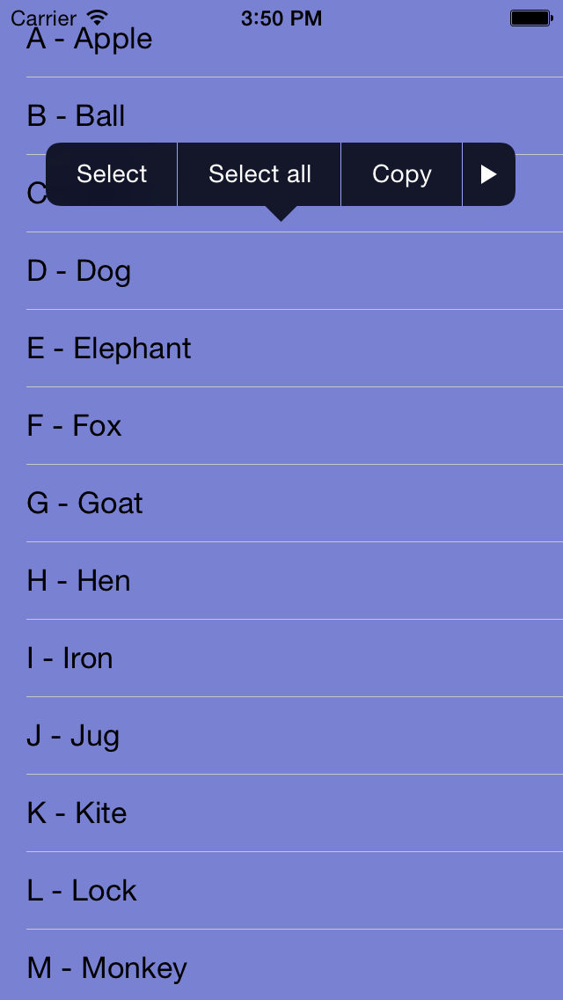

UIMenuController-Sample
=======================

Show the UIMenuController and Display Custom Edit Menus for UITableViewController on iOS 7
This application demonstrates adding a custom `UIMenuController` with custom menu options to a `UITableViewCell`.

## Features
* You need to call [-becomeFirstResponder](developer.apple.com/library/ios/documentation/uikit/reference/UIResponder_Class/Reference/Reference.html#//apple_ref/occ/instm/UIResponder/becomeFirstResponder) on the view or view controller.
* Your view or view controller needs to implement [-canBecomeFirstResponder]((developer.apple.com/library/ios/documentation/uikit/reference/UIResponder_Class/Reference/Reference.html#//apple_ref/occ/instm/UIResponder/becomeFirstResponder)) (returning YES).
* Optionally, your view or view controller can implement [-canPerformAction:action withSender:sender](https://developer.apple.com/library/ios/documentation/uikit/reference/UIResponder_Class/Reference/Reference.html#//apple_ref/occ/instm/UIResponder/canPerformAction%3awithSender%3a) to show/hide menu items on an individual basis.

## Custom Menu Items
The code is a little more involved if you want to use custom menu options, but offers a lot of flexibility. 
It's your responsibility to detect the long press and show the custom menu, and the easiest way to do this is using UILongPressGestureRecognizer on the table cell:

```
UILongPressGestureRecognizer *recognizer = [[UILongPressGestureRecognizer alloc] initWithTarget:self action:@selector(longPress:)];
[cell addGestureRecognizer:recognizer];
```
For the menu to appear, the target view must be in the responder chain. 
Many UIKit views can't become a responder by default, so you may need to subclass them to return **YES** for **canBecomeFirstResponder**.


